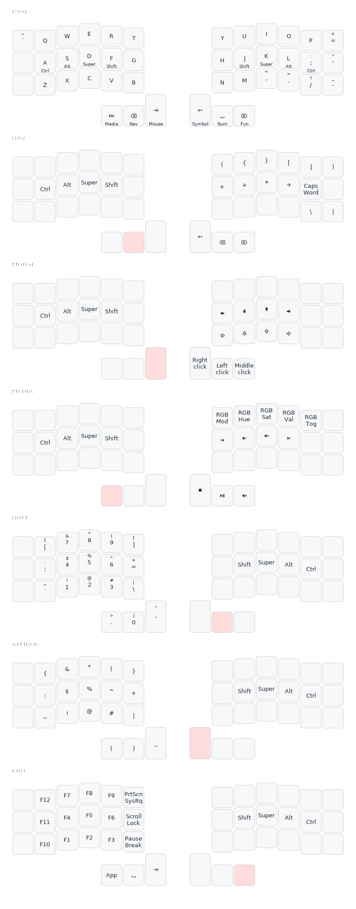

This is a keymap heavily based off of miryoku with the following changes applied:

- The layout is 3x6 instead of 3x5
- QWERTY is assumed
- VI-style navigation is assumed
- Bluetooth keys are removed
- Space and Backspace are flipped (but not Nav and Num)
- Top row on Nav layer is now `({}[])` for easier access to brackets. Useful when programming, since it's the same layer as, well, navigation keys.
- Base layer right pinkie on home row is now `;` instead of `'`
- Base layer right side extra keys from top to bottom are `='-`
- Added backtick to the extra key next to Q
- Nav layer bottom row pinkie and extra key are `\|`

- Linux specific fixes:
  - F7 and F11 are switched. F10-F12 are the Swedish åäö in my software keymap,
    but bad apps like Slack still read F11 as "please go fullscreen"

## Reference

