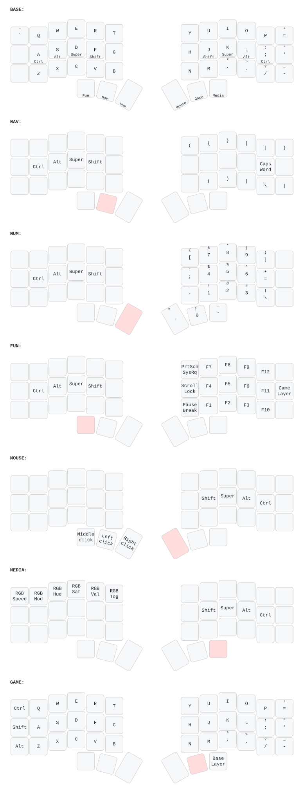

This is a keymap heavily based off of miryoku with the following changes applied:

- The layout is 3x6 instead of 3x5
- QWERTY is assumed
- VI-style navigation is assumed
- Clipboard keys are removed
- Bluetooth keys are removed
- Space and Backspace are flipped (but not Nav and Num)
- Top row on Nav layer is now `({}[])` for easier access to brackets. Useful when programming, since it's the same layer as, well, navigation keys.
- Base layer right pinkie on home row is now `;` instead of `'`
- Base layer right side extra keys from top to bottom are `='-`
- Added backtick to the extra key next to Q
- Nav layer bottom row pinkie and extra key are `\|` 
- Rearranged the thumb row layer keys so that it is: FUN, NAV, NUM, MOUSE, GAME, MEDIA. This moves the number keys to the right hand, which is identical to a numpad. Removed SYM, since it's equivalent to NUM+SHIFT.
- Added `(`, `)`, `|` to Nav layer bottom row index, middle and ring fingers.

- MacOS specific fixes:
  - Vertical mouse scroll keys are flipped
  - Horizontal mouse scroll keys are flipped
  - Ctrl and Super are swapped since MacOS is heavy on Super and could lead to pinkie strain

## Reference

